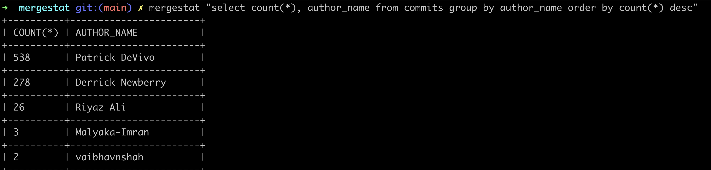

[](https://pkg.go.dev/github.com/mergestat/mergestat-lite)
[](https://github.com/mergestat/mergestat-lite/actions?workflow=tests)
[](https://goreportcard.com/report/github.com/mergestat/mergestat-lite)
[](https://www.tickgit.com/browse?repo=github.com/mergestat/mergestat-lite&branch=main)
[](https://codecov.io/gh/mergestat/mergestat-lite)
[](https://twitter.com/mergestat)


# mergestat-lite <a href="https://app.mergestat.com/"></a>

`mergestat-lite` is a command-line tool for running SQL queries on git repositories and related data sources.
It's meant for ad-hoc querying of source-code on disk through a common interface (SQL), as an alternative to patching together various shell commands.
It can execute queries that look like:
```sql
-- how many commits have been authored by user@email.com?
SELECT count(*) FROM commits WHERE author_email = 'user@email.com'
```

It installs a binary names `mergestat`.

More in-depth examples and documentation can be found on our dedicated [**documentation site**](https://docs.mergestat.com/).

Join our community on [Slack](https://join.slack.com/t/mergestatcommunity/shared_invite/zt-xvvtvcz9-w3JJVIdhLgEWrVrKKNXOYg) if you have questions, or just to say hi 🎉.

## Installation

See the [**full instructions**](https://docs.mergestat.com/getting-started-cli/installation) in our documentation.

### Homebrew

```bash
brew tap mergestat/mergestat
brew install mergestat
```

### Docker
```bash
docker run -v "${PWD}:/repo" mergestat/mergestat "select count(*) from commits"
```

### Examples

SQL queries can be executed in the CLI on local or remote git repositories.
Remote repos are cloned to a temporary directory at runtime.



The `--format` flag can be used to output `json`, `ndjson`, `csv` and more (see `mergestat -h`).
This can be useful for piping/using with other tools.

Higher level commands such as `mergestat summarize commits` generate reports without requiring a SQL input.
Learn more [here](https://docs.mergestat.com/getting-started-cli/summarize-commits) about the available flags such as `--start` to change the date range and `--json` to output as JSON.


[**Learn more in our docs**](https://docs.mergestat.com/)
